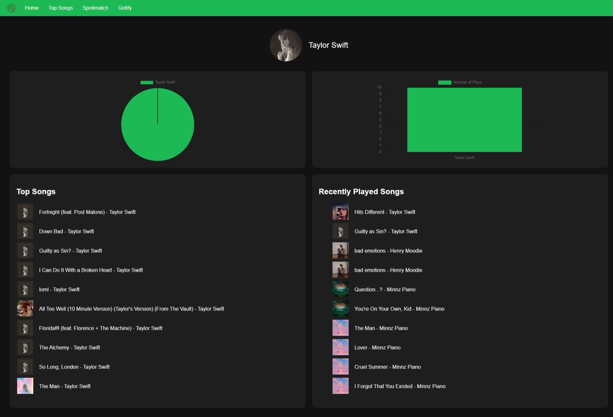
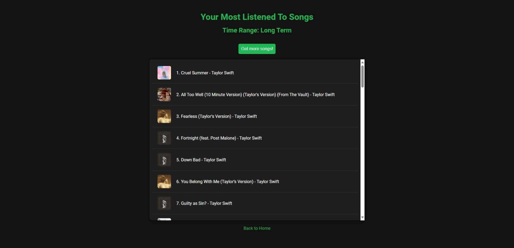
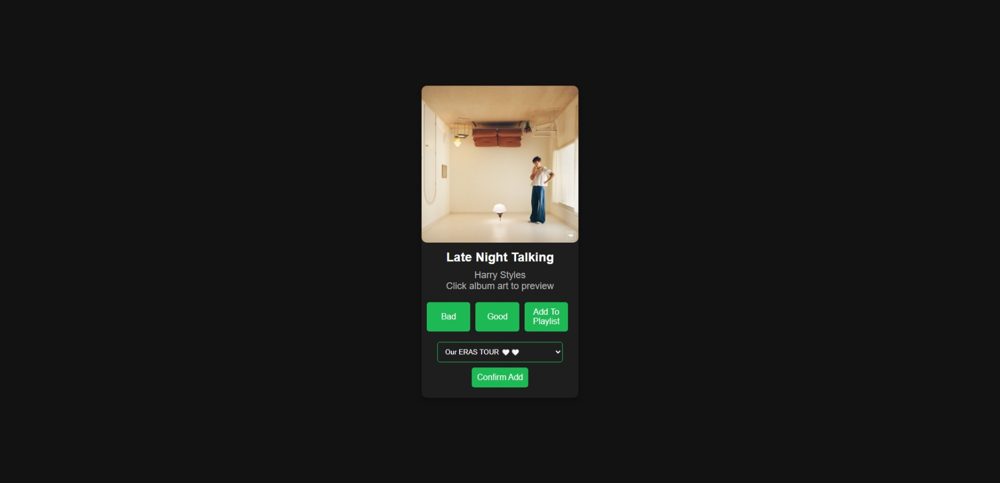
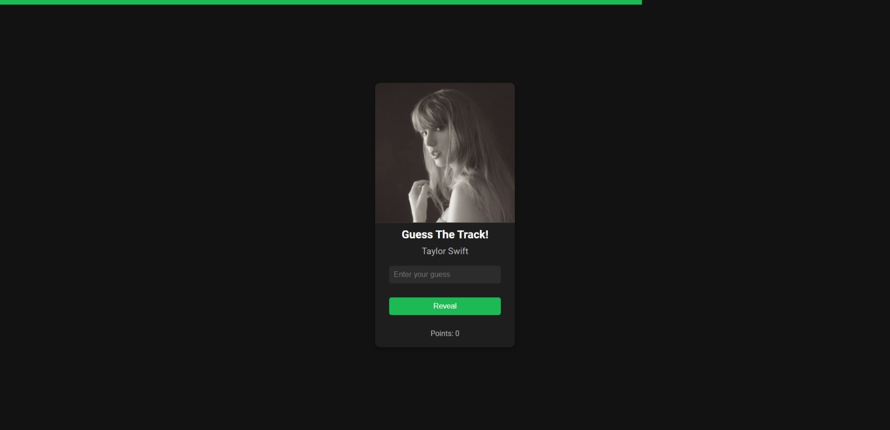
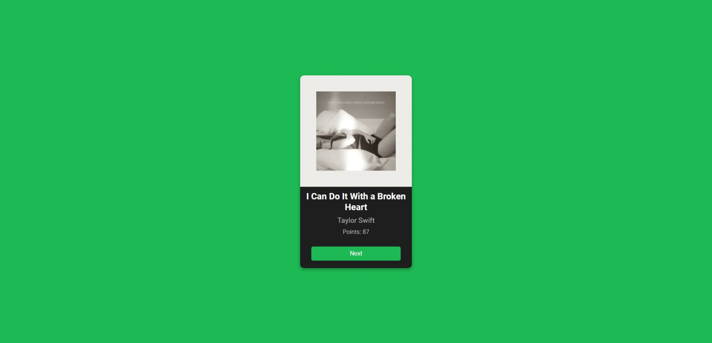
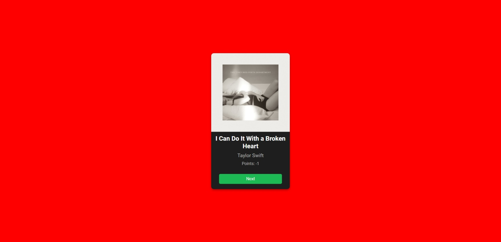

# 🎶🎶 Hubify

Hubify is a Spotify API app that offers a variety of features to enhance your music listening experience.

## Contents
- [🎵 Features](https://github.com/jasonlow2307/hubify/blob/main/README.md#--features)
- [🖥️ Try It Out](https://github.com/jasonlow2307/hubify/blob/main/README.md#-%EF%B8%8F-try-it-out)
- [🗺️ Instructions](https://github.com/jasonlow2307/hubify/blob/main/README.md#-%EF%B8%8F-instructions)
- [🖼️ Note](https://github.com/jasonlow2307/hubify/blob/main/README.md#-%EF%B8%8F-note)
<br><br>

## <a id="Features"></a> 🎵 Features

### Playing Preview of a Song
- Anytime you see an album cover, you can click it to play a short preview of the song
- **NOTE:** It is only avaialble if Spotify API provides preview for that song

### Viewing Past Listening History
- **Dashboard:** Displays your top artists, top songs, and recently played songs.

- **Top Songs Page:** Fetch more detailed information about your top songs.


### Spotimatch

- A Tinder-like page that recommends songs based on your feedback.
- Allows you to add recommended songs to your playlist
- Allows you to rate songs to with a simple swipe.


### Gotify

- A song guessing game where you select an artist.
- The faster you answer, the higher your score.



## <a id="Try_It_Out"></a> 🖥️ Try It Out

You can explore all these features at [Hubify](https://hubify.onrender.com).

Please note, Hubify is currently using the development mode of the Spotify API, which doesn't allow automatic user registration. You can register at the above link and wait for me to approve your request.

## <a id="Instructions"></a> 🗺️ Instructions

1. Clone the repository
2. Navigate to hubify/myproject/myproject/settings.py
3. Fill in Spotify API credentials and AWS credentials in the fields below
```
   # Spotify API credentials
  SPOTIFY_CLIENT_ID = 'your_spotify_client_id'
  SPOTIFY_CLIENT_SECRET = 'your_spotify_client_secret'
  SPOTIFY_REDIRECT_URI = 'your_redirect_uri'
  
  # AWS credentials
  AWS_ACCESS_KEY_ID = 'your_aws_access_key_id'
  AWS_SECRET_ACCESS_KEY = 'your_aws_secret_access_key'
  AWS_SES_REGION_NAME = 'your_aws_region_name'`
```
4. Navigate to hubify/myproject
5. Run `python manage.py runserver`

---

## <a id="Note"></a> 🖼️ Note

Please note that Hubify is a personal project and is not intended for enterprise use. It is a passion project developed by me to enhance my music listening experience. While I strive to provide a seamless and enjoyable user experience, please understand that Hubify may not have the same level of robustness and scalability as enterprise-grade applications. Thank you for your understanding and for trying out Hubify!

